# Polyglot Codebase Knowledge Graph

> Generated offline by **readmenator**. Supports C, C++, Python, Go, Rust, JS/TS, Java, C#, Shell, PHP, Dart, GDScript, Nim, ASM, Ruby, Swift, Kotlin, Scala, Lua, Elixir.
> No LLMs. No tokens. Pure static analysis. See more [here](https://github.com/grisuno/ReadMenator)

**Total Files Parsed:** 5 | **Total Symbols Extracted:** 5 | **Total Imports:** 15

<!-- ranking_model: v1.0 | weights: {ppr:0.45,auth:0.2,test:0.15,doc:0.1,fresh:0.1} | alpha:0.85 | commit:4c8e0d2 | date:2026-07-18 -->


## Table of Contents

1. [Statistics Dashboard](#statistics-dashboard)
2. [Architectural Layers](#architectural-layers)
3. [Ranked Context](#ranked-context)
4. [God Nodes](#god-nodes)
5. [Suggested Questions](#suggested-questions)
6. [Hotspot Analysis](#hotspot-analysis)
7. [Change Impact Analysis](#change-impact-analysis)
8. [Suggested Linting Rules](#suggested-linting-rules)
9. [Orphans](#orphans)
10. [Query Recipes](#query-recipes)
11. [Structural Knowledge Map](#structural-knowledge-map)
12. [UML Class Diagram](#uml-class-diagram)
13. [Code Property Graph](#code-property-graph)
14. [Architecture Reference](#architecture-reference)
    - [GO (3 files)](#go-3-files)
    - [PY (1 files)](#py-1-files)
    - [SH (1 files)](#sh-1-files)

---

## Statistics Dashboard

| Metric | Value |
|--------|-------|
| Total Files | 5 |
| Total Symbols | 5 |
| Total Imports | 15 |
| Call Edges | 0 |
| Inheritance Edges | 0 |
| Languages | 3 |
| Avg Symbols/File | 1.0 |
| Avg Imports/File | 3.0 |

### Top Files by Import Count (Fan-Out)

| File | Imports | Symbols | Language |
|------|---------|---------|----------|
| `loader_linux.go` | 6 | 2 | go |
| `loader_windows.go` | 6 | 2 | go |
| `main.go` | 2 | 1 | go |
| `app.py` | 1 | 0 | py |

---

## Architectural Layers

Auto-detected from path patterns, naming conventions, and imported frameworks.

| Layer | Files |
|-------|-------|
| utility | 5 |

### utility

- `app.py` (py, 0 symbols)
- `install.sh` (sh, 0 symbols)
- `loader_linux.go` (go, 2 symbols)
- `loader_windows.go` (go, 2 symbols)
- `main.go` (go, 1 symbols)

---

## Ranked Context

Files ranked by composite score for the current query context. The ranking combines Personalized PageRank (query relevance), global authority, test coverage, documentation coverage, and code freshness. Model: v1.0.

| Rank | File | Composite | PPR | Authority | Test | Doc |
|------|------|-----------|-----|-----------|------|-----|
| 1 | `app.py` | 0.1000 | 0.0000 | 0.0000 | 0.00 | 1.00 |
| 2 | `main.go` | 0.1000 | 0.0000 | 0.0000 | 0.00 | 1.00 |
| 3 | `loader_linux.go` | 0.0500 | 0.0000 | 0.0000 | 0.00 | 0.50 |
| 4 | `loader_windows.go` | 0.0500 | 0.0000 | 0.0000 | 0.00 | 0.50 |
| 5 | `install.sh` | 0.0000 | 0.0000 | 0.0000 | 0.00 | 0.00 |

---

## God Nodes

Most architecturally central files ranked by combined import/export degree and symbol richness.

| File | Score | Connections | PageRank |
|------|-------|-------------|----------|
| `loader_linux.go` | 0.2 | | 0.0000 |
| `loader_windows.go` | 0.2 | | 0.0000 |
| `main.go` | 0.1 | | 0.0000 |
| `app.py` | 0.0 | | 0.0000 |
| `install.sh` | 0.0 | | 0.0000 |

---

## Suggested Questions

Auto-generated exploration prompts based on graph structure:

- What does loader_linux.go depend on, and what depends on it? (0 connections)
- What does loader_windows.go depend on, and what depends on it? (0 connections)
- What does main.go depend on, and what depends on it? (0 connections)
- What is the overall architecture of this codebase?

---

## Hotspot Analysis

Files ranked by combined complexity (symbol count) and centrality (connection count). High-scoring files are architecturally critical and may need refactoring attention.

| File | Complexity | Centrality | Combined | Symbols | Connections |
|------|-----------|------------|----------|---------|-------------|
| `app.py` | 0.000 | 0.167 | 0.100 | 0 | 1 |
| `main.go` | 0.500 | 0.333 | 0.400 | 1 | 2 |
| `loader_linux.go` | 1.000 | 1.000 | 1.000 | 2 | 6 |
| `loader_windows.go` | 1.000 | 1.000 | 1.000 | 2 | 6 |
| `install.sh` | 0.000 | 0.000 | 0.000 | 0 | 0 |

---

## Change Impact Analysis

Files sorted by how many other files would be affected if they changed. High-impact files should be changed with caution.

| File | Direct Dependents | Transitive Dependents | Total Impact |
|------|------------------|----------------------|--------------|
| `app.py` | 0 | 0 | 0 |
| `install.sh` | 0 | 0 | 0 |
| `loader_linux.go` | 0 | 0 | 0 |
| `loader_windows.go` | 0 | 0 | 0 |
| `main.go` | 0 | 0 | 0 |

---

## Suggested Linting Rules

Automatically suggested linting and security rules based on patterns detected in the codebase. These can be exported as Semgrep rules using the `--export-rules` flag.

| Rule ID | Severity | Description | Language | Matches |
|---------|----------|-------------|----------|---------|
| `RM001` | info | Large number of functions in go: 5 total | go | 5 |

---

## Orphans

Files with no documentation or low connectivity. These are candidates for documentation investment or cleanup.

- `install.sh` (0 symbols, no doc)

---

## Query Recipes

Example queries you can run against this knowledge base using the ranking engine:

```
# Find files most relevant to a concept
readmenator query "Where is the import resolver implemented?"

# Rank files by relevance to a topic
readmenator query "How does documentation generation work?"

# Explain why a file ranks highly
readmenator query "explain readmenator/_documentation.py"

# Trace dependency paths with ranked context
readmenator query "path from CLI to exporter"
```

The ranking model uses the following signals:

- **Personalized PageRank** (45% weight): query-specific relevance via seed propagation
- **Global Authority** (20% weight): structural importance via standard PageRank
- **Test Coverage** (15% weight): fraction of symbols referenced in test files
- **Doc Coverage** (10% weight): presence of docstrings and file-level docs
- **Freshness** (10% weight): recent modification activity

Results include score decomposition and justification paths for each ranked item.

---

## Structural Knowledge Map

```mermaid
graph TD
    classDef mod fill:#1e1e1e,stroke:#ff6666,stroke-width:2px,color:#fff;
    classDef cls fill:#2d2d2d,stroke:#4ec9b0,stroke-width:2px,color:#fff;
    classDef fn fill:#333,stroke:#dcdcaa,stroke-width:1px,color:#dcdcaa;
    classDef ext fill:#111,stroke:#666,stroke-dasharray:5 5,color:#aaa;
    loader_linux_go["loader_linux.go (go)"]
    class loader_linux_go mod;
    loader_linux_go_executeLoader["executeLoader"]
    class loader_linux_go_executeLoader fn;
    loader_linux_go --> loader_linux_go_executeLoader
    loader_linux_go_readShellcodeFromURL["readShellcodeFromURL"]
    class loader_linux_go_readShellcodeFromURL fn;
    loader_linux_go --> loader_linux_go_readShellcodeFromURL
    loader_windows_go["loader_windows.go (go)"]
    class loader_windows_go mod;
    loader_windows_go_executeLoader["executeLoader"]
    class loader_windows_go_executeLoader fn;
    loader_windows_go --> loader_windows_go_executeLoader
    loader_windows_go_readShellcodeFromURL["readShellcodeFromURL"]
    class loader_windows_go_readShellcodeFromURL fn;
    loader_windows_go --> loader_windows_go_readShellcodeFromURL
    main_go["main.go (go)"]
    class main_go mod;
    main_go_main["main"]
    class main_go_main fn;
    main_go --> main_go_main
    app_py["app.py (py)"]
    class app_py mod;
    install_sh["install.sh (sh)"]
    class install_sh mod;
    ext_os["os"]
    class ext_os ext;
    app_py -.->|imports| ext_os
    ext_fmt["fmt"]
    class ext_fmt ext;
    loader_linux_go -.->|imports| ext_fmt
    ext_io["io"]
    class ext_io ext;
    loader_linux_go -.->|imports| ext_io
    ext_net_http["http"]
    class ext_net_http ext;
    loader_linux_go -.->|imports| ext_net_http
    ext_strconv["strconv"]
    class ext_strconv ext;
    loader_linux_go -.->|imports| ext_strconv
    ext_time["time"]
    class ext_time ext;
    loader_linux_go -.->|imports| ext_time
    ext_unsafe["unsafe"]
    class ext_unsafe ext;
    loader_linux_go -.->|imports| ext_unsafe
    loader_windows_go -.->|imports| ext_fmt
    loader_windows_go -.->|imports| ext_io
    loader_windows_go -.->|imports| ext_net_http
    loader_windows_go -.->|imports| ext_strconv
    loader_windows_go -.->|imports| ext_time
    loader_windows_go -.->|imports| ext_unsafe
    ext_flag["flag"]
    class ext_flag ext;
    main_go -.->|imports| ext_flag
    main_go -.->|imports| ext_fmt
```



---

## Code Property Graph

Machine-readable Code Property Graph (CPG) in JSON-LD format. This block allows AI agents to parse the full structural graph without additional file reads. Compatible with GraphRAG pipelines.

```json
{"@context": "https://schema.org", "analysis": {"communities": [], "god_nodes": [{"node_id": "loader_linux.go", "score": 0.2}, {"node_id": "loader_windows.go", "score": 0.2}, {"node_id": "main.go", "score": 0.1}, {"node_id": "app.py", "score": 0.0}, {"node_id": "install.sh", "score": 0.0}], "surprising_connections": []}, "edges": [{"confidence": "EXTRACTED", "relation": "imports", "source": "app.py", "target": "os"}, {"confidence": "EXTRACTED", "relation": "imports", "source": "loader_linux.go", "target": "fmt"}, {"confidence": "EXTRACTED", "relation": "imports", "source": "loader_linux.go", "target": "io"}, {"confidence": "EXTRACTED", "relation": "imports", "source": "loader_linux.go", "target": "net/http"}, {"confidence": "EXTRACTED", "relation": "imports", "source": "loader_linux.go", "target": "strconv"}, {"confidence": "EXTRACTED", "relation": "imports", "source": "loader_linux.go", "target": "time"}, {"confidence": "EXTRACTED", "relation": "imports", "source": "loader_linux.go", "target": "unsafe"}, {"confidence": "EXTRACTED", "relation": "imports", "source": "loader_windows.go", "target": "fmt"}, {"confidence": "EXTRACTED", "relation": "imports", "source": "loader_windows.go", "target": "io"}, {"confidence": "EXTRACTED", "relation": "imports", "source": "loader_windows.go", "target": "net/http"}, {"confidence": "EXTRACTED", "relation": "imports", "source": "loader_windows.go", "target": "strconv"}, {"confidence": "EXTRACTED", "relation": "imports", "source": "loader_windows.go", "target": "time"}, {"confidence": "EXTRACTED", "relation": "imports", "source": "loader_windows.go", "target": "unsafe"}, {"confidence": "EXTRACTED", "relation": "imports", "source": "main.go", "target": "flag"}, {"confidence": "EXTRACTED", "relation": "imports", "source": "main.go", "target": "fmt"}], "generator": "readmenator", "metadata": {"edge_count": 15, "file_count": 5, "language_count": 3, "symbol_count": 5}, "nodes": [{"doc": "_*_ coding: utf8 _*_", "id": "app.py", "kind": "module", "label": "app.py", "language": "py", "sha256": "57b21bdb023585b8", "symbol_count": 0, "symbols": []}, {"id": "install.sh", "kind": "module", "label": "install.sh", "language": "sh", "sha256": "c907d80fd6734993", "symbol_count": 0, "symbols": []}, {"doc": "loader_linux.go go:build linux", "id": "loader_linux.go", "kind": "module", "label": "loader_linux.go", "language": "go", "sha256": "54f839e2f111b293", "symbol_count": 2, "symbols": [{"kind": "function", "line": 30, "name": "executeLoader", "signature": "func executeLoader("}, {"kind": "function", "line": 50, "name": "readShellcodeFromURL", "signature": "func readShellcodeFromURL("}]}, {"doc": "loader_windows.go go:build windows", "id": "loader_windows.go", "kind": "module", "label": "loader_windows.go", "language": "go", "sha256": "09212b235b228975", "symbol_count": 2, "symbols": [{"kind": "function", "line": 30, "name": "executeLoader", "signature": "func executeLoader("}, {"kind": "function", "line": 50, "name": "readShellcodeFromURL", "signature": "func readShellcodeFromURL("}]}, {"doc": "main.go", "id": "main.go", "kind": "module", "label": "main.go", "language": "go", "sha256": "8f11263fd39ecba0", "symbol_count": 1, "symbols": [{"kind": "function", "line": 9, "name": "main", "signature": "func main("}]}], "type": "CodePropertyGraph", "version": "1.0"}
```

---

## Architecture Reference

### GO (3 files)

#### `loader_linux.go`
**Path:** `loader_linux.go`
**File Doc:** *loader_linux.go go:build linux*

**Functions:**
- `executeLoader` (line 30) `func executeLoader(`
- `readShellcodeFromURL` (line 50) `func readShellcodeFromURL(`

#### `loader_windows.go`
**Path:** `loader_windows.go`
**File Doc:** *loader_windows.go go:build windows*

**Functions:**
- `executeLoader` (line 30) `func executeLoader(`
- `readShellcodeFromURL` (line 50) `func readShellcodeFromURL(`

#### `main.go`
**Path:** `main.go`
**File Doc:** *main.go*

**Functions:**
- `main` (line 9) `func main(`

### PY (1 files)

#### `app.py`
**Path:** `app.py`
**File Doc:** *_*_ coding: utf8 _*_*

*No symbols extracted*

### SH (1 files)

#### `install.sh`
**Path:** `install.sh`

*No symbols extracted*
