# Polyglot Codebase Knowledge Graph

> Generated offline by **readmenator**. Supports C, C++, Python, Go, Rust, JS/TS, Java, C#, Shell, PHP, Dart, GDScript, Nim, ASM.
> No LLMs. No tokens. Pure static analysis. See more [here](https://github.com/grisuno/ReadMenator)

**Total Files Parsed:** 5 | **Total Symbols Extracted:** 5 | **Total Imports:** 15

## Structural Knowledge Map

```mermaid
graph TD
    classDef mod fill:#1e1e1e,stroke:#ff6666,stroke-width:2px,color:#fff;
    classDef cls fill:#2d2d2d,stroke:#4ec9b0,stroke-width:2px,color:#fff;
    classDef fn fill:#333,stroke:#dcdcaa,stroke-width:1px,color:#dcdcaa;
    classDef ext fill:#111,stroke:#666,stroke-dasharray:5 5,color:#aaa;
    loader_linux_go["loader_linux.go (go)"]
    class loader_linux_go mod;
    loader_linux_go_executeLoader["executeLoader"]
    class loader_linux_go_executeLoader fn;
    loader_linux_go --> loader_linux_go_executeLoader
    loader_linux_go_readShellcodeFromURL["readShellcodeFromURL"]
    class loader_linux_go_readShellcodeFromURL fn;
    loader_linux_go --> loader_linux_go_readShellcodeFromURL
    loader_windows_go["loader_windows.go (go)"]
    class loader_windows_go mod;
    loader_windows_go_executeLoader["executeLoader"]
    class loader_windows_go_executeLoader fn;
    loader_windows_go --> loader_windows_go_executeLoader
    loader_windows_go_readShellcodeFromURL["readShellcodeFromURL"]
    class loader_windows_go_readShellcodeFromURL fn;
    loader_windows_go --> loader_windows_go_readShellcodeFromURL
    main_go["main.go (go)"]
    class main_go mod;
    main_go_main["main"]
    class main_go_main fn;
    main_go --> main_go_main
    app_py["app.py (py)"]
    class app_py mod;
    install_sh["install.sh (sh)"]
    class install_sh mod;
    ext_os["os"]
    class ext_os ext;
    app_py -.->|imports| ext_os
    ext_fmt["fmt"]
    class ext_fmt ext;
    loader_linux_go -.->|imports| ext_fmt
    ext_io["io"]
    class ext_io ext;
    loader_linux_go -.->|imports| ext_io
    ext_net_http["http"]
    class ext_net_http ext;
    loader_linux_go -.->|imports| ext_net_http
    ext_strconv["strconv"]
    class ext_strconv ext;
    loader_linux_go -.->|imports| ext_strconv
    ext_time["time"]
    class ext_time ext;
    loader_linux_go -.->|imports| ext_time
    ext_unsafe["unsafe"]
    class ext_unsafe ext;
    loader_linux_go -.->|imports| ext_unsafe
    loader_windows_go -.->|imports| ext_fmt
    loader_windows_go -.->|imports| ext_io
    loader_windows_go -.->|imports| ext_net_http
    loader_windows_go -.->|imports| ext_strconv
    loader_windows_go -.->|imports| ext_time
    loader_windows_go -.->|imports| ext_unsafe
    ext_flag["flag"]
    class ext_flag ext;
    main_go -.->|imports| ext_flag
    main_go -.->|imports| ext_fmt
```

---

## Architecture Reference

### GO (3 files)

#### `loader_linux.go`
**Path:** `loader_linux.go`

**Functions:**
- `executeLoader` (line 30) `func executeLoader(`
- `readShellcodeFromURL` (line 50) `func readShellcodeFromURL(`

#### `loader_windows.go`
**Path:** `loader_windows.go`

**Functions:**
- `executeLoader` (line 30) `func executeLoader(`
- `readShellcodeFromURL` (line 50) `func readShellcodeFromURL(`

#### `main.go`
**Path:** `main.go`

**Functions:**
- `main` (line 9) `func main(`

### PY (1 files)

#### `app.py`
**Path:** `app.py`

*No symbols extracted*

### SH (1 files)

#### `install.sh`
**Path:** `install.sh`

*No symbols extracted*
